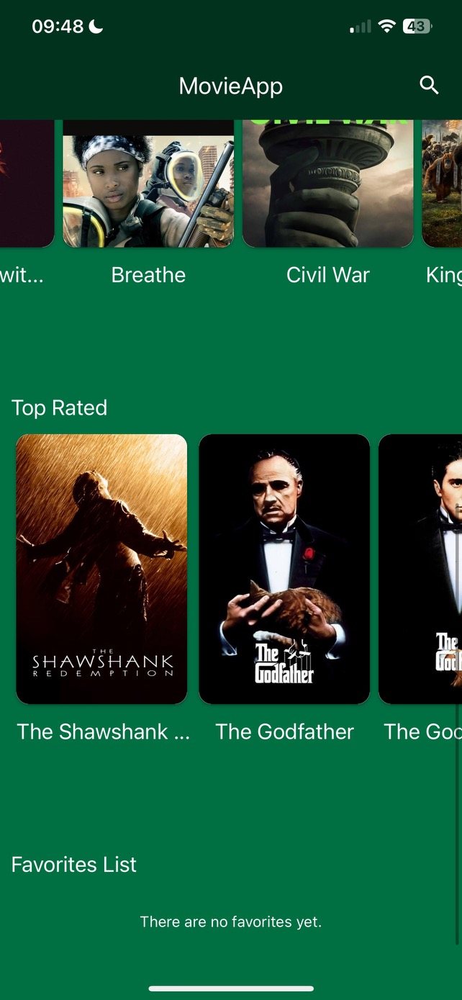
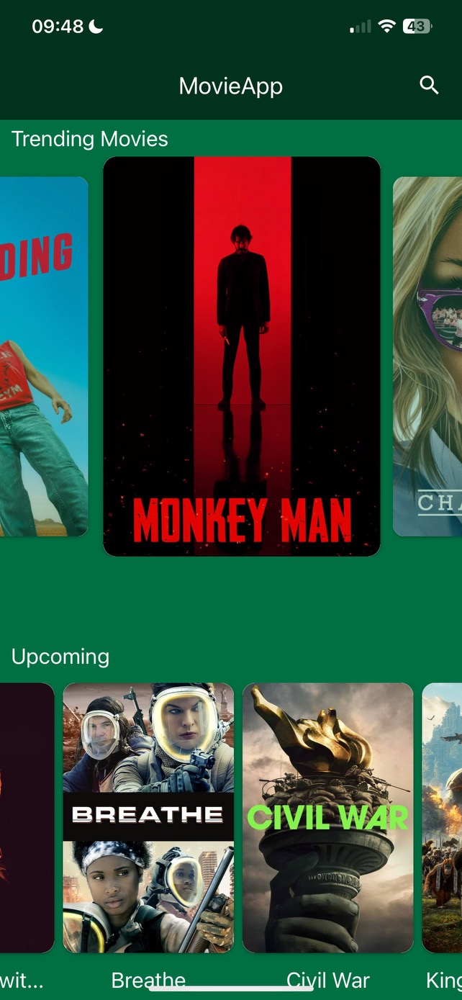
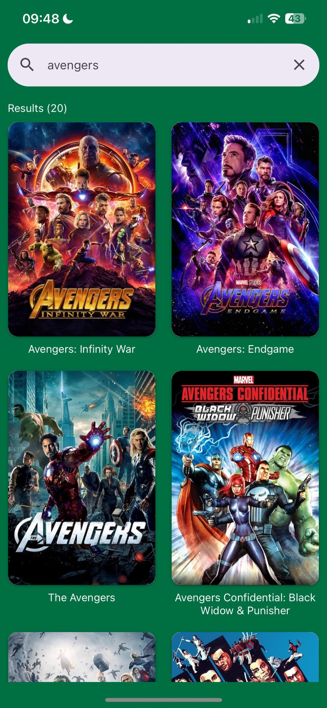
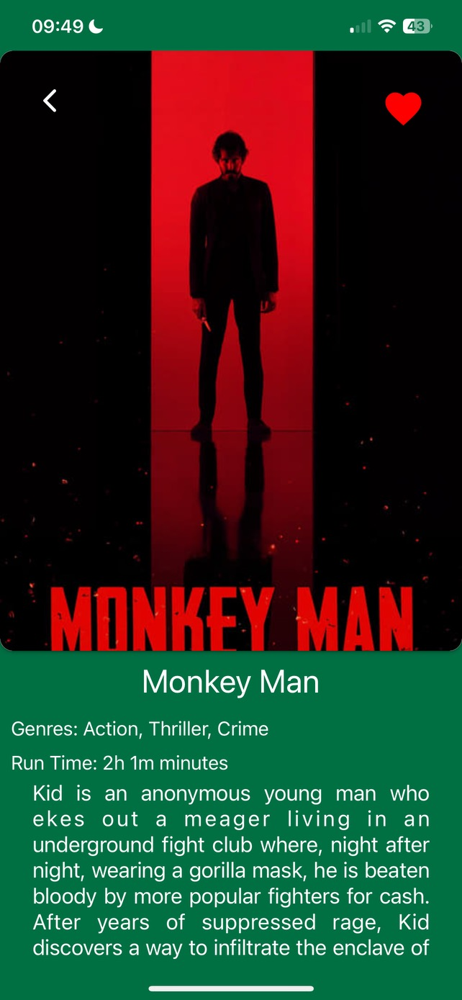
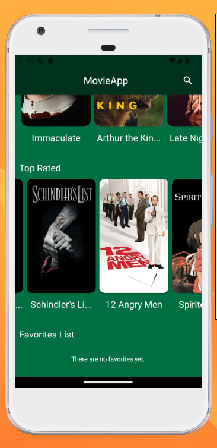
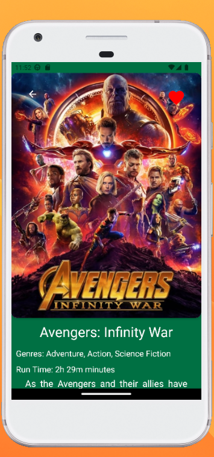

# Movie App

This is a React Native movie app that allows users to search for movies, view trending movies, and see movie details. It utilizes the TMDB API for movie data to search and display the movies listed on the screen.

## Features

- Trending movies
- Upcoming movies
- Top rated movies
- Movie search
- Movie details

## Setup

1. Clone the repository:
   -git clone https://github.com/husbanahmed/MovieApp.git

2. Installation
   -npm install
   -npm i react-native-snap-carousel@4.0.0-beta.6
   -npm install react-native-paper
   -npm install react-native-safe-area-context
   -npm install @reduxjs/toolkit
   -npm install @react-navigation/native
   -npm install -g expo-cli

## Screenshots

IOS-

ANDROID-

## License

MIT License

Copyright (c) 2024 Husban Ahmed

Permission is hereby granted, free of charge, to any person obtaining a copy
of this software and associated documentation files (the "Software"), to deal
in the Software without restriction, including without limitation the rights
to use, copy, modify, merge, publish, distribute, sublicense, and/or sell
copies of the Software, and to permit persons to whom the Software is
furnished to do so, subject to the following conditions:

The above copyright notice and this permission notice shall be included in all
copies or substantial portions of the Software.

THE SOFTWARE IS PROVIDED "AS IS", WITHOUT WARRANTY OF ANY KIND, EXPRESS OR
IMPLIED, INCLUDING BUT NOT LIMITED TO THE WARRANTIES OF MERCHANTABILITY,
FITNESS FOR A PARTICULAR PURPOSE AND NONINFRINGEMENT. IN NO EVENT SHALL THE
AUTHORS OR COPYRIGHT HOLDERS BE LIABLE FOR ANY CLAIM, DAMAGES OR OTHER
LIABILITY, WHETHER IN AN ACTION OF CONTRACT, TORT OR OTHERWISE, ARISING FROM,
OUT OF OR IN CONNECTION WITH THE SOFTWARE OR THE USE OR OTHER DEALINGS IN THE
SOFTWARE.
